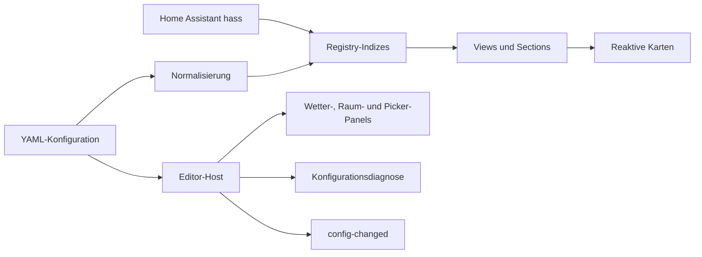

# Architektur und Entwicklung

[Installation und Schnellstart](../README.MD) · [Release-Ablauf](../RELEASE.md)


### Code-Split Bundles

**TypeScript** (ES2020, strict) → **Webpack** → Code-Split Chunks:

| Chunk | Größe | Inhalt |
|-------|-------|--------|
| main | ~8 KB | Entry Point, Versions-/Chunk-Logik, Custom-Element-Registrierung |
| lit | ~16 KB | Lit Framework (shared) |
| core | ~239 KB | Registry, Utils, Übersetzungen, Sections, Overview und Custom Cards |
| views | ~39 KB | Lichter, Rollos, Sicherheit, Batterien, Klima, CCTV, Wartung und Raum-Details |
| editor | ~252 KB | Konfigurations-UI und YAML-Parser (nur bei Bedarf geladen) |
| nummerierte Chunks | ~1–2 KB je Chunk | Kleine dynamische Hilfsmodule |

Die Größen sind unkomprimierte Richtwerte des Builds von Version 1.29.0; Webpack-Hashes und Größen ändern sich bei neuen Builds.

### Performance-Design

Die Strategy folgt denselben Patterns wie HA's offizielle Home- und Areas-Strategien:

- **Pre-filtered Area-Controls:** Area-Cards bekommen nur Controls die im Raum tatsächlich existieren, nicht pauschal alle.
- **Pre-resolved Views:** Alle Views werden in `generate()` vollständig aufgelöst statt als Strategy-Stubs zurückgegeben.
- **Eager Chunk Loading:** JS-Chunks werden sofort beim Laden des Entry-Points gestartet, nicht erst wenn `generate()` aufgerufen wird.
- **Reaktive Custom Cards:** LitElement mit `willUpdate()` — nur relevante State-Änderungen lösen Re-Renders aus.
- **Tile-Card-Pooling:** DOM-Elemente werden wiederverwendet statt neu erstellt.


## Datenfluss und Verantwortlichkeiten



Der Einstieg registriert die Strategy sofort und startet die Runtime-Chunks. `generate()` normalisiert die Konfiguration, initialisiert die Registry und löst die Views vorab auf. Die Registry bleibt die gemeinsame Quelle für Entitäts-, Geräte-, Bereichs- und Domain-Indizes. Sichtbarkeit wird dort zentral gefiltert.

Der Editor-Host besitzt Konfiguration, Expansionen, Caches und Ereignisweitergabe. Die fokussierten Panels erhalten stabile, typisierte Facades mit gebundenen Aktionen und Zugriff auf den aktuellen Hostzustand. Sie erzeugen Templates, ohne Konfigurationskopien als zweiten Zustand zu halten. Wetter-, Raum- und Picker-spezifische Hilfsfunktionen liegen bei ihren Modulen. Optionsmetadaten bündeln einfache Werte, Übersetzungsschlüssel, Abhängigkeiten und Kompatibilitätsaliase; freie YAML-Blöcke behalten ihre eigene Verarbeitung.

## Cache-Invalidierung

- Registry-Indizes werden bei unveränderten Registry-Daten und Bereichsfiltern wiederverwendet. Zustandswerte dürfen nicht als Registry-Metadaten dienen; verfügbare und zurückkehrende Zustände werden über die vorhandenen Kandidaten geprüft.
- Editor-Auswahllisten hängen von Registry-Daten, Namen und Sprache ab. Bereichs- und Wetterlisten werden bei geänderten Quellen invalidiert.
- Die Diagnose analysiert YAML pro Konfigurationsidentität. Neue Konfigurationen müssen als neue Objekte übergeben werden; Zustandsupdates prüfen nur die erfassten Referenzen.
- Karten behalten gepoolte Unterkarten. Geänderte Attribute, Sprache, Zuordnungen und Verfügbarkeit aktualisieren die Darstellung; unveränderte native Konfigurationen lösen kein erneutes `setConfig()` aus. Veraltete asynchrone Ergebnisse werden verworfen.

## Tests und lokale Entwicklung

Unit-Tests liegen neben ihrem Quellmodul. Separate `*.contract.test.ts`-Dateien bewahren voneinander unabhängige Fixtures und globale HA-Mocks. Gemeinsame Fixtures, Browserprüfungen und Skriptintegrationstests liegen unter `tests/`.

```sh
npm ci
npm run verify:release
npx playwright install chromium
npm run test:browser
npm audit
git diff --check
```

Browserprüfungen verwenden Chromium mit minimalen HA-Komponenten-Doubles. Sie prüfen den echten Editor und Strategy-Code, YAML-Roundtrip und Fehlerbehandlung, unbekannte Felder, Expansionen, Kartenpicker, Pooling, Kamera-Lifecycle und responsive Layouts. Echte HA-Karten, Streams und Geräteleistung benötigen weiterhin eine separate Live-Prüfung. CI führt diese Browserprüfungen in einem verpflichtenden eigenen Job aus.

Buildausgaben unter `dist/` sind für HACS erforderlich und werden mit Änderungen am Bundle eingecheckt. Die Version wird ausschließlich in `package.json` gepflegt; `npm run version:sync` gleicht Lockfile und Runtime-Version an. Reine Strukturpflege benötigt keine Versionsanhebung.

Die kleine Aliasdefinition wird vom Einstieg verwendet. Die vollständigen Optionsmetadaten gehören zum erst bei Editoröffnung geladenen Editor-Chunk; sie dürfen den sofort registrierenden Einstieg nicht vergrößern.

## Strukturpflege vom 2026-10-05

- Der Editor-Host wurde von rund 274 auf 199 KB reduziert. Wetterlayout, Raumoptionen, Kartenpicker, Kartenkatalog, YAML-Parser und Styles haben eigene Module. Konfiguration, Expansionen und Ereignisse bleiben beim Host.
- Die README wurde von 625 auf 302 Zeilen gekürzt; Konfigurationsreferenz, Diagnose und Architektur wurden ohne Verlust der Inhalte verlinkt ausgelagert.
- `VERSION.txt` entfällt, weil `package.json.version` die einzige Versionsquelle ist. Die Versionsprüfung kontrolliert weiterhin Lockfile, Runtime und Distribution; Releases unterscheiden Versionsänderungen von Dependency-Änderungen.
- Die früheren Unit-Test-Dateien unter `tests/editor`, `tests/sections`, `tests/utils` und `tests/views` wurden zu den Quellmodulen verschoben. Separate Contract-Dateien erhalten die Isolation unterschiedlicher globaler HA-Mocks. Alle 198 bisherigen Tests bleiben erhalten; 18 zusätzliche Fälle prüfen Versionierung und Optionsmetadaten.
- Alte gehashte Core-/Editor-Bundles wurden durch den Produktionsbuild entfernt und durch ihre aktuellen JS-, Gzip- und Brotli-Dateien ersetzt. Temporäre Refactoring-Skripte wurden nach Gebrauch entfernt.
- `.chglog`, Codacy-Konfiguration, Changelog, Assets, Lizenzdateien, vorhandene Benchmarknachweise und Entwicklungsabhängigkeiten bleiben erhalten. Externe Nutzung und öffentliche Kartenverträge sind kein ausreichender Grund für eine Löschung nach bloßer Importsuche.

Validiert: 47 Testdateien mit 216 Tests, Typecheck, Lint, verpflichtende Formatprüfung, Übersetzungen, Build, Versions-/Produktions-/HACS-Prüfungen, Workflow-YAML und lokale Dokumentationslinks. Der npm-Audit meldete keine bekannten Schwachstellen. Browserprüfungen bestehen mit lokalem Chrome bei 360, 768 und 1280 Pixeln; Screenshots bei 360 und 1280 Pixeln wurden geprüft. GitHub Actions und echtes HA-Karten-/Streamrendering wurden nicht live ausgeführt. Webpack meldet weiterhin seine Größenhinweise für Core und Editor.
